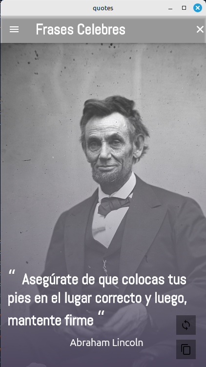
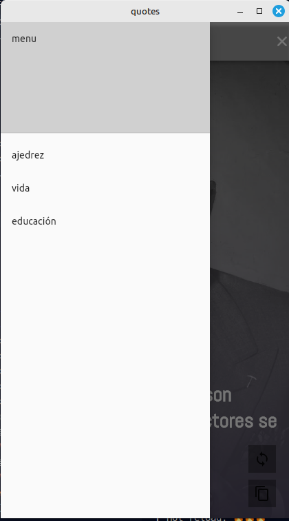
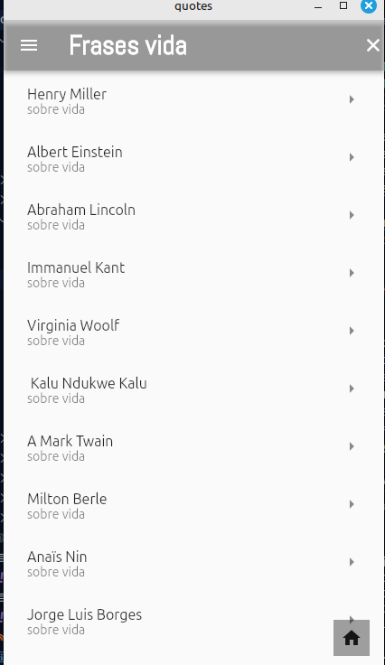

Markdown

# quotes

**Una aplicación Flutter para disfrutar de frases célebres.**

Esta aplicación te permite descubrir frases inspiradoras de personajes históricos de forma aleatoria. Sumérgete en un mundo de sabiduría y motivación con esta sencilla pero poderosa herramienta.

### Características principales:

- **Pantalla principal:**
  - Muestra una frase célebre aleatoria en cada carga.
  - Diseño intuitivo y fácil de usar.
- **Pantalla de lista por temáticas:**
  - Explora frases agrupadas por categorías como amor, vida, éxito, etc.
  - Navega fácilmente entre las diferentes temáticas.
- **Pantalla de frases por autor:**
  - Descubre todas las frases de tus autores favoritos.
  - Filtra y busca frases por autor específico.

### Tecnologías utilizadas:

- **Flutter:** Framework para desarrollo de aplicaciones móviles multiplataforma.
- **Dart:** Lenguaje de programación utilizado  
  en Flutter.

### Cómo ejecutar el proyecto:

1. **Clonar el repositorio:**

   ```bash
   git clone https://tu-repositorio.git

   ```

2. **Instalar dependencias:**

   ```bash
   flutter pub get

   ```

3. **Ejecutar la aplicación:**
   ```bash
   flutter run
   ```

## Capturas de la App






